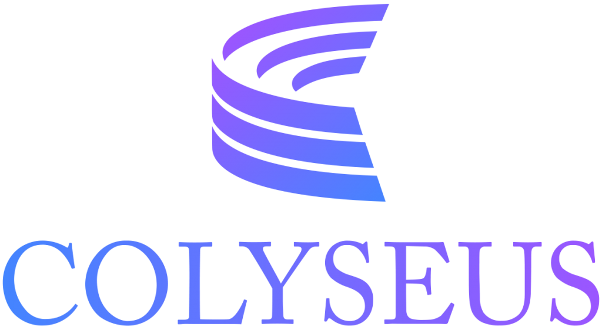

<p align="center">
    <a href="https://github.com/paulocoutinhox/axmol-multiplayer-colyseus" target="_blank" rel="noopener noreferrer">
        
    </a>
</p>

<br>

# Axmol Multiplayer With Colyseus

This is a project that shows how to create a simple multiplayer game with Colyseus library.

Web demo: https://axmp-colyseus.netlify.app/

## Files To Add

These are the new files that you need:

- /ColyseusLib
- /ColyseusServer
- /Source/ColyseusData

## Code Changes

There are some small changes that you need do to your project to include this.

### CMake root file: CMakeLists.txt

1 - Add Colyseus directory:

```cmake
add_subdirectory(ColyseusLib)
```

2 - Add flag to disable Boost:

```cmake
target_compile_definitions(${APP_NAME} PUBLIC MSGPACK_NO_BOOST)
```

## Game Server

The game server is inside `ColyseusServer` folder.

To start the server execute the following commands:

```bash
cd ColyseusServer
npm install
npm start
```

or simply:

```bash
make start-colyseus
```
